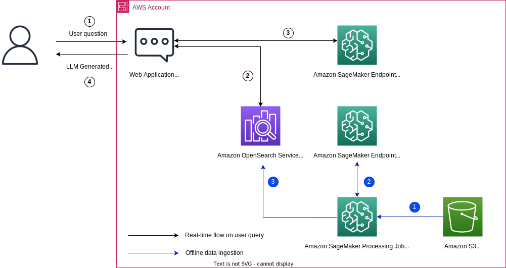

# Bite-sized RAG Projects on AWS

Collection of the bite-sized RAG(Retrieval Augmented Generation) projects implemented on AWS

- Simple, easy to learn RAG Architectures
- Deployable by IaC (AWS CDK)
- Various combinations of Vector Store, LLMs, and Embedding Models

| Vector store | Hosting LLM, Embedding Model | Git Url | Architecture |
|--------------|------------------------------|---------|--------------|
| opensearch | bedrock | [rag-with-amazon-bedrock-and-opensearch](https://github.com/aws-samples/aws-kr-startup-samples/tree/main/gen-ai/rag-with-amazon-bedrock-and-opensearch) |  |
| opensearch | sagemaker | [rag-with-amazon-opensearch-and-sagemaker](https://github.com/aws-samples/rag-with-amazon-opensearch-and-sagemaker) |  |
| opensearch serverless | bedrock | [rag-with-amazon-bedrock-and-opensearch-serverless](https://github.com/aws-samples/aws-kr-startup-samples/tree/main/gen-ai/rag-with-amazon-bedrock-and-opensearch-serverless) |  |
| opensearch serverless | sagemaker | [rag-with-amazon-opensearch-serverless-and-sagemaker](https://github.com/aws-samples/rag-with-amazon-opensearch-serverless-and-sagemaker) |  |
| postgresql + pgvector | bedrock | [rag-with-amazon-bedrock-and-postgresql-using-pgvector](https://github.com/aws-samples/aws-kr-startup-samples/tree/main/gen-ai/rag-with-amazon-bedrock-and-postgresql-using-pgvector) |  |
| postgresql + pgvector | sagemaker | [rag-with-amazon-postgresql-using-pgvector-and-sagemaker](https://github.com/aws-samples/rag-with-amazon-postgresql-using-pgvector) |  |
| documentdb | bedrock | [rag-with-amazon-bedrock-and-documentdb](https://github.com/aws-samples/rag-with-amazon-bedrock-and-documentdb) |  |
| documentdb | sagemaker | TBD |
| memorydb | bedrock | [rag-with-amazon-bedrock-and-memorydb](https://github.com/aws-samples/rag-with-amazon-bedrock-and-memorydb) |  |
| memorydb | sagemaker | TBD | |
| kendra | bedrock | [rag-with-amazon-bedrock-and-kendra](https://github.com/aws-samples/qa-app-with-rag-using-amazon-bedrock-and-kendra) |  |
| kendra | sagemaker | [rag-with-amazon-kendra-and-sagemaker](https://github.com/aws-samples/aws-kr-startup-samples/tree/main/gen-ai/rag-with-amazon-kendra-and-sagemaker) |  |
| knowldege base + opensearch serverless | bedrock | [rag-with-knowledge-bases-for-amazon-bedrock-using-opensearch-serverless (CDK L3 Constructs Version)](https://github.com/aws-samples/aws-kr-startup-samples/tree/main/gen-ai/rag-with-knowledge-bases-for-amazon-bedrock-using-gen-ai-cdk-constructs) |  |
| |  | [rag-with-knowledge-bases-for-amazon-bedrock-using-opensearch-serverless (CDK L1 Constructs Version)](https://github.com/aws-samples/aws-kr-startup-samples/tree/main/gen-ai/rag-with-knowledge-bases-for-amazon-bedrock) |  |
|knowldege base + postgresql | bedrock | [rag-with-knowledge-bases-for-amazon-bedrock-using-aurora-postgresql](https://github.com/aws-samples/aws-kr-startup-samples/tree/main/gen-ai/rag-with-knowledge-bases-for-amazon-bedrock-using-aurora-postgresql) |  |

## References

[RAG Architecture: From Concepts to Implementations (slides)](https://speakerdeck.com/ksmin23/rag-akitegceo-gaenyeombuteo-guhyeonggaji)

